# agent-leak-system-troubleshooting
Memory Leak, CPU Spike, Deadlock troubleshooting report for agent-leak-app
# Agent Leak App System Troubleshooting Report

## 프로젝트 개요

본 저장소는 **agent-leak-app**을 대상으로 Linux 환경에서 발생하는 대표적인 시스템 장애를 분석한 트러블슈팅 결과를 정리한 저장소입니다.

본 프로젝트에서는 단순히 프로그램 실행 결과를 확인하는 것이 아니라 운영 환경에서 수집 가능한 로그와 시스템 명령어를 기반으로 장애의 원인을 분석하고, GitHub Issue 형태의 기술 리포트를 작성하는 것을 목표로 하였습니다.

---

# 분석 대상

본 프로젝트에서는 다음 세 가지 장애를 분석하였습니다.

* Memory Leak (OOM)
* CPU Spike (CPU Occupancy)
* Deadlock

---

# 개발 환경

| 항목       | 내용                  |
| -------- | ------------------- |
| OS       | Ubuntu 22.04 (WSL2) |
| Terminal | Ubuntu (WSL)        |
| 실행 파일    | agent-leak-app-x86  |
| 사용자      | 일반 계정 (songha)      |

---

# 프로젝트 구조

```
agent/
├── api_keys/
│   └── secret.key
├── logs/
├── upload_files/
└── agent-leak-app-x86
```

---

# 사전 환경 구성

필수 디렉터리 생성

```bash
mkdir -p ~/agent/logs
mkdir -p ~/agent/upload_files
mkdir -p ~/agent/api_keys
```

secret.key 생성

```bash
echo "agent_api_key_test" > ~/agent/api_keys/secret.key
```

---

# 환경 변수 설정

```bash
export AGENT_HOME=$HOME/agent
export AGENT_PORT=15034
export AGENT_UPLOAD_DIR=$AGENT_HOME/upload_files
export AGENT_KEY_PATH=$AGENT_HOME/api_keys
export AGENT_LOG_DIR=$AGENT_HOME/logs
```

---

# OOM(Memory Leak) 실험

### Before

```bash
export MEMORY_LIMIT=256
export CPU_MAX_OCCUPY=50
export MULTI_THREAD_ENABLE=true
```

실행

```bash
./agent-leak-app-x86
```

확인 결과

* Heap 메모리가 지속적으로 증가
* 275MB에서 MemoryGuard가 동작
* SELF-TERMINATED 발생

주요 로그

```
Current Heap: 25MB
Current Heap: 50MB
Current Heap: 75MB
...
Current Heap: 275MB

Memory limit exceeded (275MB >= 256MB)

SELF-TERMINATED
```

---

### After

```bash
export MEMORY_LIMIT=512
export MULTI_THREAD_ENABLE=false
```

실행 결과

* Heap 증가
* Memory Cache Flushed
* MEMORY RECOVERED
* 종료되지 않고 정상 유지

결론

* MEMORY_LIMIT 증가 시 생존 시간이 증가함
* 메모리 증가 패턴 자체는 계속 발생
* 근본 원인은 Memory Leak

---

# CPU Spike 실험

### Before

```bash
export CPU_MAX_OCCUPY=10
```

확인 로그

```
Current Load : 5%

Current Load : 8%

Current Load : 10%

Peak reached (10%)

Starting cooldown
```

결과

CPU 사용량이 10%에 도달하면 Cooldown 수행

---

### After

```bash
export CPU_MAX_OCCUPY=100
```

확인 로그

```
Current Load : 5%

Current Load : 6%

Current Load : 10%

Current Load : 15%

Current Load : 16%
```

결과

CPU 사용량이 지속적으로 증가

10%에서 제한되지 않음

---

# Deadlock 실험

환경

```bash
export MULTI_THREAD_ENABLE=true
```

실행 결과

```
Worker-Thread-1

LOCK ACQUIRED

Worker-Thread-2

LOCK ACQUIRED

WAITING

BLOCKED
```

확인 명령어

```bash
ps -ef | grep agent
```

결과

```
1818
1819
```

스레드 확인

```bash
ps -L -p 1819
```

결과

```
1819

1820

1821
```

분석

* Thread1이 Shared_Memory_A를 점유
* Thread2가 Socket_Pool_B를 점유
* 서로 상대 자원을 기다리며 교착상태 발생

---

# 사용한 Linux 명령어

프로세스 확인

```bash
ps -ef | grep agent
```

스레드 확인

```bash
ps -L -p PID
```

CPU 확인

```bash
top
```

프로세스 종료

```bash
kill PID
```

---

# 작성한 GitHub Issues

* Issue #1 OOM Crash 분석
* Issue #2 CPU Spike 분석
* Issue #3 Deadlock 분석

---

# 프로젝트를 통해 학습한 내용

* Linux 환경변수 구성
* 프로세스 및 스레드 관리
* 메모리 누수 분석
* CPU 사용량 모니터링
* 교착상태(Deadlock) 원인 분석
* GitHub Issue 기반 장애 리포트 작성

  # 프로젝트 구조

```text
agent/
├── api_keys/
│   └── secret.key
├── logs/
├── upload_files/
└── agent-leak-app-x86
```

### 📷 프로젝트 구조

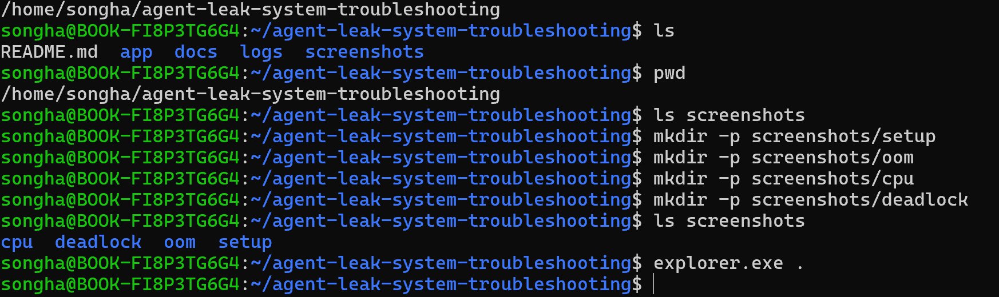

---

# 사전 환경 구성

필수 디렉터리 생성

```bash
mkdir -p ~/agent/logs
mkdir -p ~/agent/upload_files
mkdir -p ~/agent/api_keys
```

secret.key 생성

```bash
echo "agent_api_key_test" > ~/agent/api_keys/secret.key
```

### 📷 실행 파일 확인

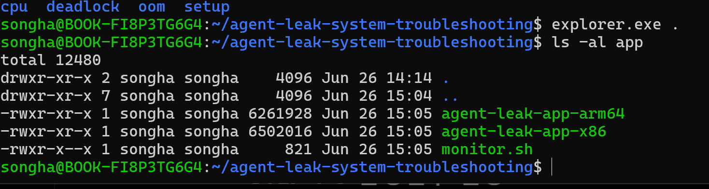

---

# 환경 변수 설정

```bash
export AGENT_HOME=$HOME/agent
export AGENT_PORT=15034
export AGENT_UPLOAD_DIR=$AGENT_HOME/upload_files
export AGENT_KEY_PATH=$AGENT_HOME/api_keys
export AGENT_LOG_DIR=$HOME/agent/logs

export MEMORY_LIMIT=512
export CPU_MAX_OCCUPY=50
export MULTI_THREAD_ENABLE=false
```

### 📷 환경 변수 설정

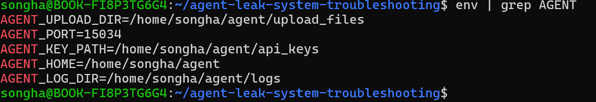

---

# Boot Success

프로그램이 정상적으로 Boot Sequence를 통과한 화면입니다.

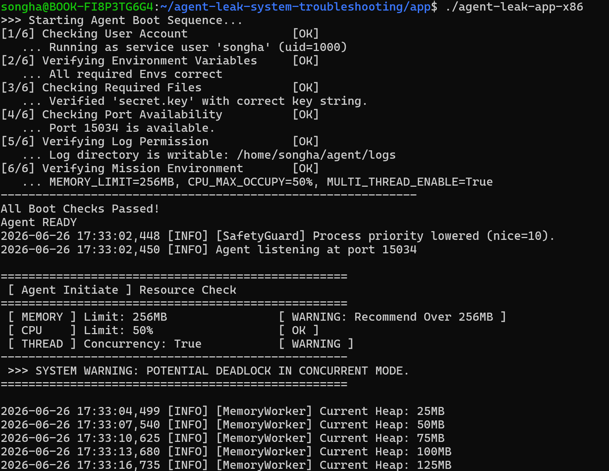

---

# OOM (Memory Leak) 실험

## Before

```bash
export MEMORY_LIMIT=256
export CPU_MAX_OCCUPY=50
export MULTI_THREAD_ENABLE=true

./agent-leak-app-x86
```

### 확인 결과

* Heap 메모리가 지속적으로 증가
* 275MB에서 MemoryGuard 동작
* SELF-TERMINATED 발생

주요 로그

```
Current Heap: 25MB
Current Heap: 50MB
Current Heap: 75MB
...
Current Heap: 275MB

Memory limit exceeded (275MB >= 256MB)

SELF-TERMINATED
```

### 📷 OOM 종료 직전 로그

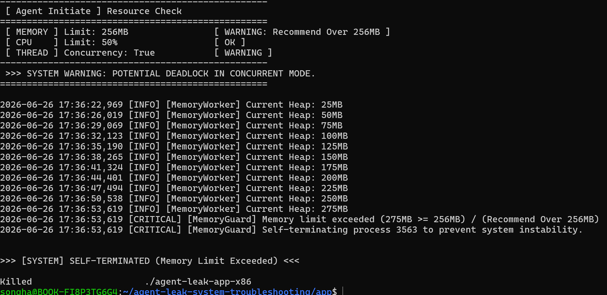

---

### 📷 monitor.sh 관제 결과

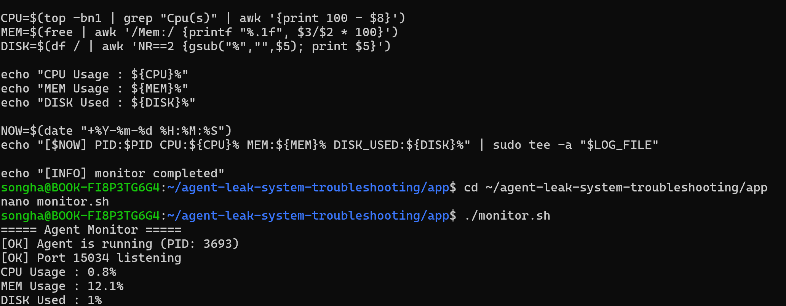

---

## After

```bash
export MEMORY_LIMIT=512
export MULTI_THREAD_ENABLE=false
```

실행 결과

* Heap 증가
* Memory Cache Flushed
* MEMORY RECOVERED
* 종료되지 않고 정상 유지

### 📷 MEMORY_LIMIT=512 실행 결과

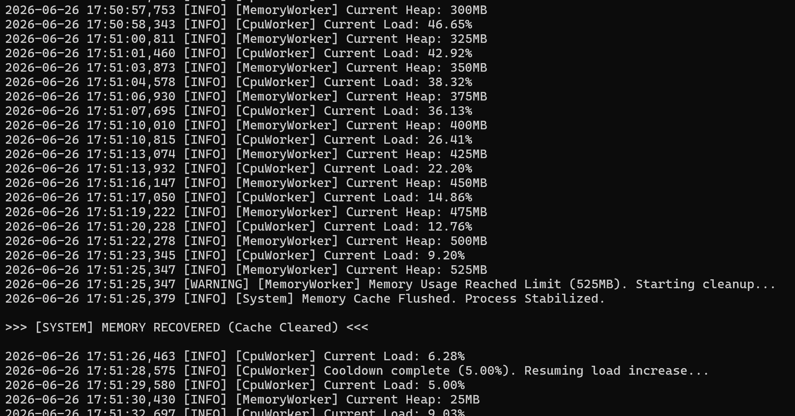

---

### 결론

* MEMORY_LIMIT 증가 시 생존 시간이 증가함
* 메모리 증가 패턴 자체는 계속 발생
* 근본 원인은 Memory Leak

---

# CPU Spike 실험

## Before

```bash
export CPU_MAX_OCCUPY=10
```

확인 로그

```
Current Load : 5%
Current Load : 8%
Current Load : 10%
Peak reached (10%)
Starting cooldown
```

### 📷 CPU Cooldown

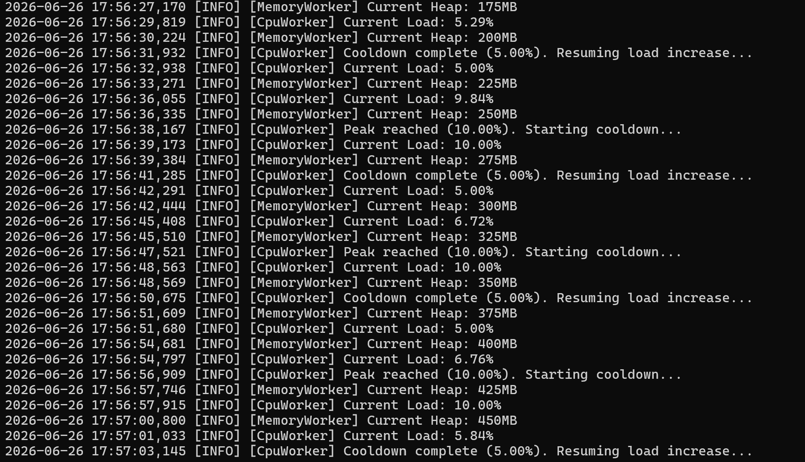

---

### 📷 top 명령어 확인

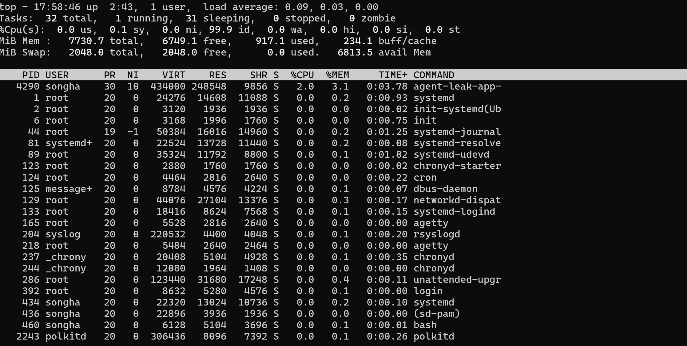

---

## After

```bash
export CPU_MAX_OCCUPY=100
```

확인 로그

```
Current Load : 44%

Current Load : 54%

CPU Threshold Violated!

WATCHDOG

SIGTERM
```

### 📷 Watchdog 종료

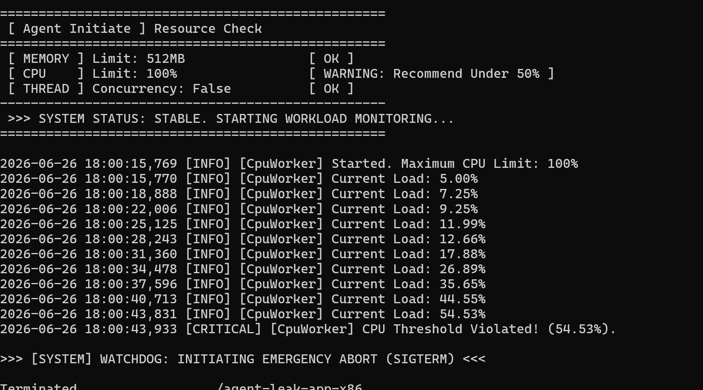

---

### 결과

* CPU_MAX_OCCUPY=10에서는 10% 도달 시 Cooldown 수행
* CPU_MAX_OCCUPY=100에서는 CPU 사용량이 지속 증가
* Watchdog 정책이 SIGTERM으로 프로세스를 종료

---

# Deadlock 실험

## 환경

```bash
export MULTI_THREAD_ENABLE=true
```

실행 결과

```
Worker-Thread-1

LOCK ACQUIRED

Worker-Thread-2

LOCK ACQUIRED

WAITING

BLOCKED
```

### 📷 WAITING / BLOCKED

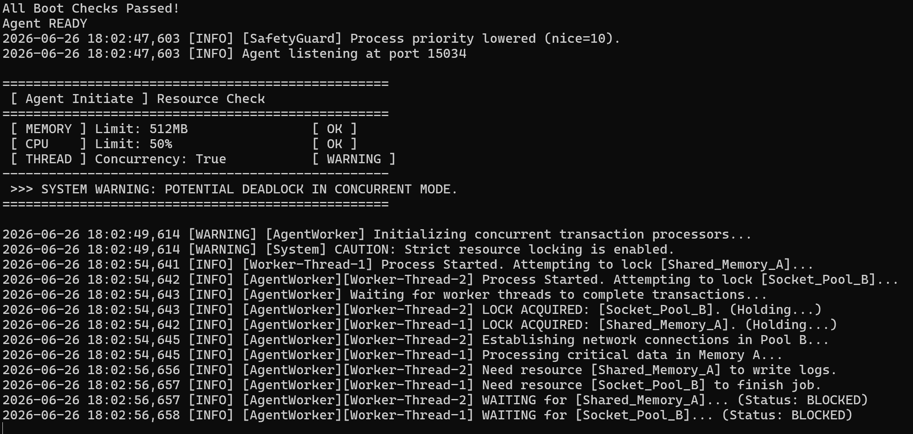

---

확인 명령어

```bash
ps -ef | grep agent
```

### 📷 PID 존재 확인

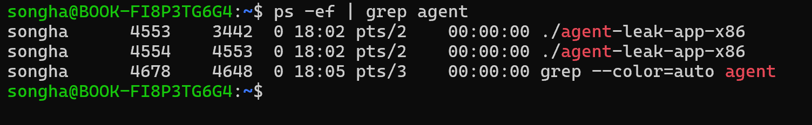

---

스레드 확인

```bash
ps -L -p PID
```

### 📷 Thread 상태

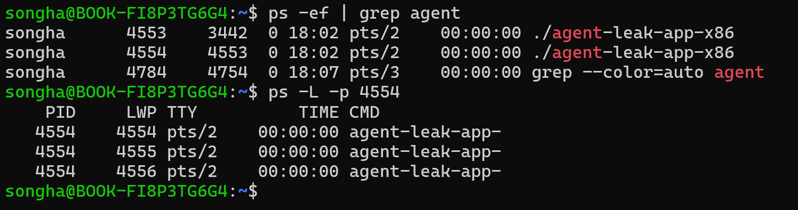

---

## Deadlock 해결

```bash
export MULTI_THREAD_ENABLE=false
```

### 📷 Deadlock 해결

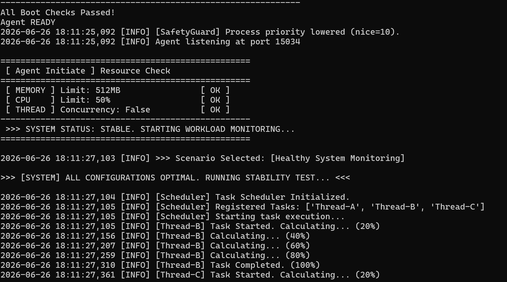

---

(선택) 프로세스 종료 확인

### 📷 Process 종료

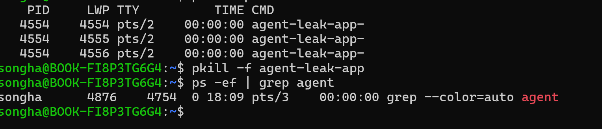

---

### 분석

* Thread-1이 Shared_Memory_A를 점유
* Thread-2가 Socket_Pool_B를 점유
* 두 스레드가 서로 상대 자원을 기다리며 순환 대기(Circular Wait)가 발생
* MULTI_THREAD_ENABLE=false 설정 후 Deadlock 없이 정상 수행됨


---

# 참고

본 저장소는 운영 환경에서 발생 가능한 시스템 장애를 Linux 명령어와 프로그램 로그를 기반으로 분석한 학습 프로젝트입니다.
